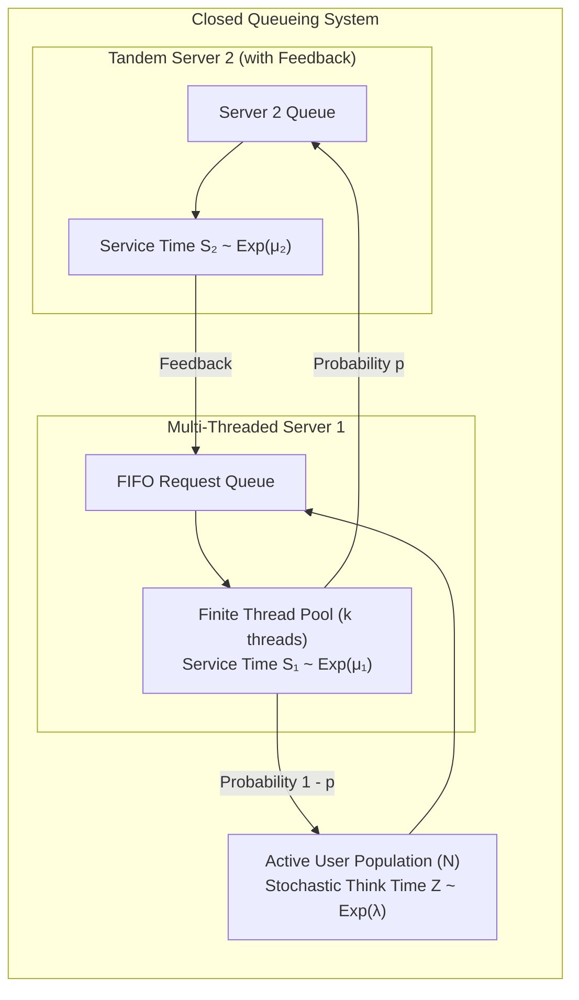

# Discrete-Event Simulation of Multi-Threaded Closed Queueing Systems

[](https://isocpp.org/)
[]()
[]()
[](https://www.cse.iitb.ac.in/)

> **Academic Affiliation**: Course Project for **CS 681: Performance Analysis of Systems and Networks**, IIT Bombay  
> **Instructor**: **Prof. Varsha Apte**  
> **Collaborators**: **Dheeraj Kumar Maradana** ([@dheerajkumar2005](https://github.com/dheerajkumar2005)), **Sunny** ([@sunny4095](https://github.com/sunny4095))

---

## 📌 Executive Summary

This repository contains a high-performance **Discrete-Event Simulator (DES)** written in modern C++ to model multi-threaded web servers and distributed closed queueing networks.

Using a priority-queue event-driven scheduler, the simulator accurately predicts response times, throughput, queue lengths, and server utilization under stochastic think times, service time distributions, finite thread pool constraints, and request timeouts. The empirical simulation outputs are rigorously validated against analytical **Mean Value Analysis (MVA)** queueing theory formulations and real load-test benchmarks.

---

## 🏗️ Architecture & Network Topology



### Core Simulation Capabilities:
1. **Event Scheduling Engine**: Min-heap priority queue tracking discrete system events (`EVENT_THINK_DONE`, `EVENT_SERVICE_START`, `EVENT_SERVICE_DONE`, `EVENT_TIMEOUT`).
2. **Resource Constraints**: Models finite worker thread pools, context switching overheads, and drop-tail vs. infinite buffers.
3. **Tandem Network & Bottleneck Analysis**: Simulates a two-server network with feedback routing to locate bottleneck stations when traffic parameters shift.
4. **Analytical Validation**: Automatically benchmarks simulated throughput and mean response times against closed queueing theory MVA predictions.

---

## 📁 Repository Structure

```
├── simulator.hh / simulator.cc         # Single-server discrete-event classes (Request, User, Server, Metrics)
├── main.cc                             # Single-server simulation driver generating metrics.csv
├── tandem_simulator.hh / .cc           # 2-server tandem network with feedback routing
├── tandem_main.cc                      # Tandem network simulation driver
├── tandem_config.txt                   # Simulation parameters (users, think times, service rates, routing probabilities)
└── plot_tandem.py                      # Telemetry visualization and MVA theoretical overlay plots
```

---

## 🚀 Building & Running

### 1. Compile Simulator Binaries
```bash
# Compile single server simulator
g++ -std=c++17 -O3 -o sim main.cc simulator.cc

# Compile tandem server simulator
g++ -std=c++17 -O3 -o tandem_sim tandem_main.cc tandem_simulator.cc
```

### 2. Run Simulation
```bash
./sim
./tandem_sim
```

### 3. Generate Analytical Plots
```bash
pip install matplotlib pandas numpy
python3 plot_tandem.py
```
